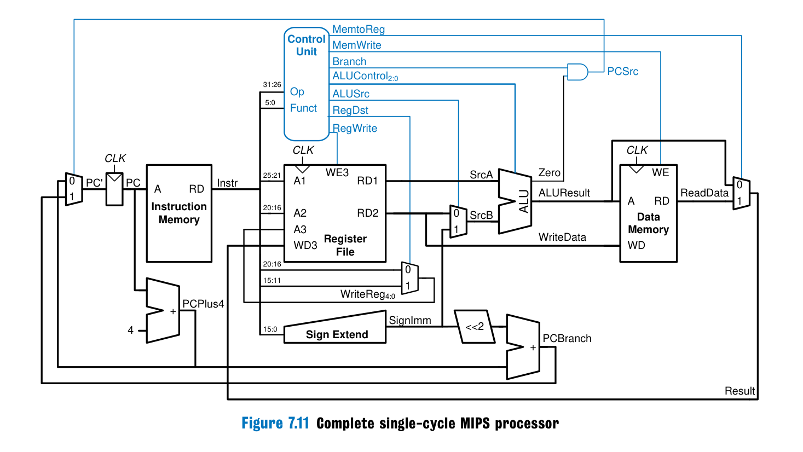
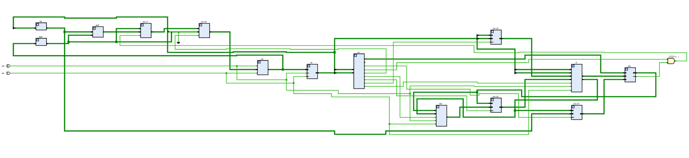

# Single Cycle MIPS Processor – Verilog HDL

## Overview

This project presents the design and implementation of a 32-bit Single Cycle MIPS Processor using Verilog HDL.

The processor was developed to execute a subset of MIPS instructions through a complete single-cycle datapath and control architecture. The design focuses on RTL implementation, functional verification, simulation analysis, and synthesis flow.

The processor supports arithmetic, logical, memory access, branching, and jump operations while maintaining single-cycle instruction execution.

---

# System Architecture

The processor architecture includes the following major components:

* Program Counter (PC)
* Instruction Memory
* Control Unit
* Register File
* ALU (Arithmetic Logic Unit)
* Sign Extension Unit
* Data Memory
* Branch & Jump Logic
* Multiplexers and Control Signals

## System Architecture Diagram

## Supported Instructions

### R-Type Instructions

* `add`
* `sub`
* `and`
* `or`
* `slt`

### I-Type Instructions

* `addi`
* `lw`
* `sw`
* `beq`

### J-Type Instructions

* `j`

---

# Tools & Techniques

## Languages & Tools

* Verilog HDL
* QuestaSim
* QuestaLint
* Vivado

## Verification Methodology

A major focus of this project was developing a structured verification environment instead of relying only on manual testing.

An automated testbench was developed using iterative `for-loop` based verification to dynamically validate the execution of:

* `addi`
* `slt`
* `beq`
* `add`
* `j`

Additional directed test cases were implemented for:

* `lw`
* `sw`
* `and`
* `or`
* `sub`

The verification process focused on:

* ALU functionality
* Register write-back correctness
* Branch decision validation
* Jump operation execution
* Memory read/write behavior
* Control signal integrity

Static RTL analysis and code quality checks were also performed using QuestaLint to identify potential RTL issues and improve design quality.

---

# Simulation (QuestaSim)

Functional simulation and debugging were performed using QuestaSim.

Waveform analysis was used to verify:

* Correct instruction execution
* Register updates
* ALU outputs
* Memory operations
* PC behavior
* Branch and jump functionality

---

# Synthesis (Vivado)

The RTL design was synthesized using Vivado to validate hardware feasibility and ensure synthesizable RTL implementation.

The synthesis flow helped verify:

* RTL correctness
* Resource utilization
* Synthesizable design structure
* Hardware implementation feasibility

---

# Future Work

The next phase of this project is implementing a Multi-Cycle MIPS Processor to address some of the limitations of the Single-Cycle architecture, including:

* Reduced hardware redundancy
* Better hardware resource utilization
* Improved execution efficiency
* More optimized datapath operation
